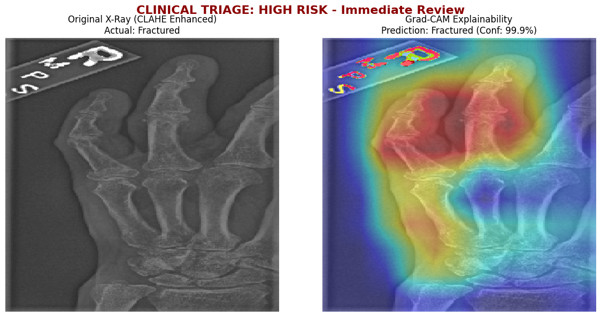

# Reliable Finger Fracture Detection with Explainable AI

An end-to-end machine learning system designed to detect finger fractures from X-ray images. Built to assist medical professionals, this project not only predicts abnormalities but provides visual explainability and confidence metrics to support clinical triage.

## Key Features
* **High-Accuracy Classification:** Evaluated both MobileNet and DenseNet architectures, achieving superior fracture detection performance with MobileNet.
* **Explainable AI (XAI):** Implemented Grad-CAM heatmaps to highlight the exact anatomical regions the model focuses on when predicting a fracture.
* **Clinical Triage & Confidence Calibration:** Provides a calibrated confidence score alongside predictions, allowing for the prioritization of critical cases in a clinical workflow.

## Tech Stack
* **Language:** Python
* **Deep Learning Frameworks:** TensorFlow (Keras) 
* **Models:** MobileNet, DenseNet
* **Other Libraries:** OpenCV, NumPy, Pandas, Matplotlib, Scikit-learn

## Dataset
This project utilizes the **MURA (musculoskeletal radiographs)** dataset, one of the largest public radiographic image datasets. 
* *Note: Due to file size limits, the dataset is not hosted in this repository. You can access the MURA dataset [here](https://stanfordmlgroup.github.io/competitions/mura/).*

## Results & Visuals
Extensive testing showed that MobileNet outperformed DenseNet in detecting subtle finger fractures while maintaining a lightweight architecture suitable for clinical deployment. 

**Grad-CAM Heatmap Example:**

